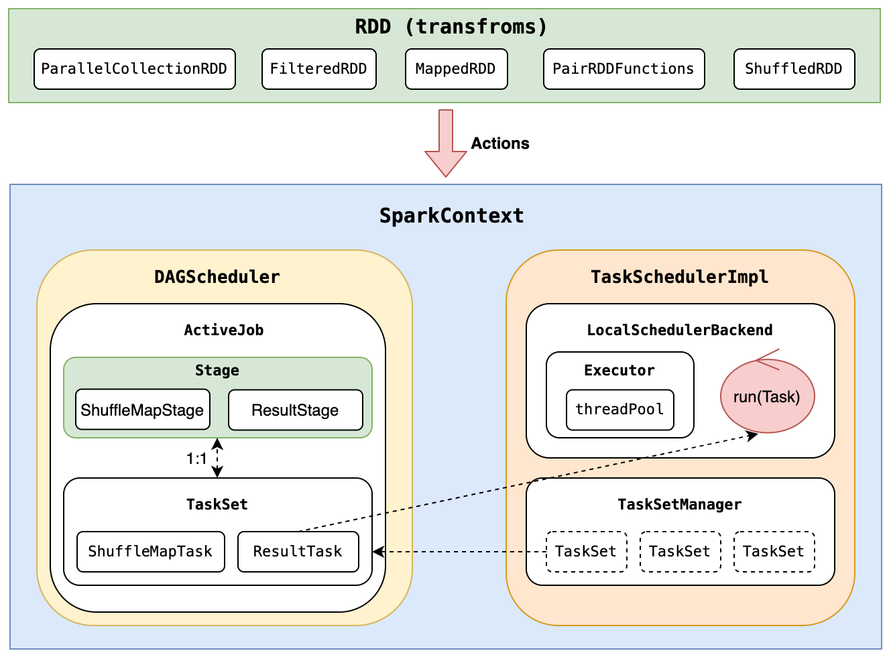
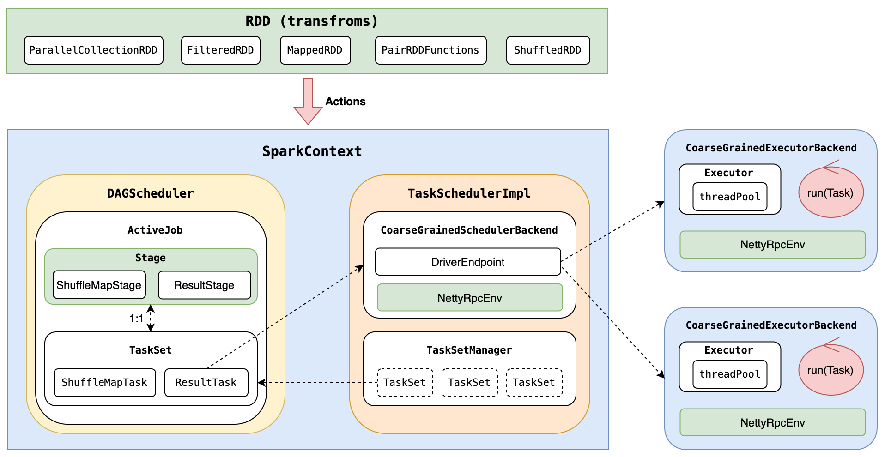

# What's this?
This is Scala project that imitate and rewrite Spark's RDD (core part). The main propose is full understanding the running logic of RDD, and have ablity to implement a custom version of RDD (speaking is easier than actions, we need do the hard part, right?).

# How to move the first step?
> "The Spark core engine itself has changed little since it was first released." -- Spark The Definitive Guide

Fully Spark project is very big and complicated. So I just only focus on RDD's logic, and the source code part is in the `core` dir. Unfortunately, it's still difficult. Then, I do two things, make life easier:
- Find a good teacher, Lijie Xu, who have a book about the design of Spark. The book is very easy to understand and the detail is very clear.
- Find history versions, that have less codes
  - [commit](https://github.com/apache/spark/tree/5b021ce0990ec675afc6939cc2c06f041c973d17)
  - [tag v1.0.0](https://github.com/apache/spark/tree/v1.0.0/)

# Implement detail

## Features
- Partition, Shuffle
- Job/Stage/Task, mapping to logic/physical plan
- Rpc module, basic on Netty framework
- Running mode, local and multi-process(multi executor)
- ~~Cache~~, not support
- ~~Checkpoint~~, not support

## Abstract perspective
You will better understant the boundary between the `Driver` and `Executor`.
### Run local

### Run multi-process

# How to run
## Enviroment
- Java 1.8
- Scala 2.13.8

## Entry point
```
// MainApp.scala
def main(args: Array[String]) = {

  val sc = new SparkContext(new SparkConf(false).setAll(parseArguments(args)))

  logger.warn(s"Enter application, driver = ${sc.master}")
  
  val rdd0 = sc.parallelize(Seq("a", "aa", "aaa", "aaaa", "aaa", "aaa", "aa", "aaaa", "aaaa", "aaaa"), 3)

  rdd0.map(k => (k, 1.toLong)).count().foreach(p => println(s"count ${p._1} -> ${p._2}")) 

  val rdd1 = sc.parallelize(Seq("aa" -> 1, "bb" -> 2, "aa" -> 3, "bc" -> 4, "bc" -> 5, "cc" -> 6, "ac" -> 7, "ac" -> 8, "ab" -> 9), 3)

  rdd1.groupByKey(2).foreach(p => println(s"group ${p._1} -> ${p._2.toSeq}"))

  val rdd2 = sc.parallelize(Seq("aa" -> 10, "bb" -> 20, "aa" -> 30, "bc" -> 40, "bc" -> 50, "cc" -> 60, "ac" -> 70, "ac" -> 80, "ab" -> 90), 2)

  rdd2.cogroup(rdd1).foreach{ cg => println(s"k = ${cg._1}, ${cg._2._1.toSeq} | ${cg._2._2.toSeq}") }
  
  sc.stop()
}
```

## Local mode
```
// open terminal
>sbt
>run --master local[2]

--------------------------------------------------------------
// Console Output
2022-09-06 16:48:02 WARN MainApp$: Enter application, driver = local[2]
2022-09-06 16:48:02 WARN LocalEndpoint: start local endpoint.
count aaaa -> 4
count a -> 1
count aaa -> 3
count aa -> 2
group ab -> List(9)
group bc -> List(4, 5)
group bb -> List(2)
group aa -> List(1, 3)
group cc -> List(6)
group ac -> List(7, 8)
k = ab, List(90) | List(9)
k = cc, List(60) | List(6)
k = bb, List(20) | List(2)
k = ac, List(70, 80) | List(7, 8)
k = aa, List(10, 30) | List(1, 3)
k = bc, List(40, 50) | List(4, 5)
[success] Total time: 11 s, completed 2022-9-6 16:48:03
```

## Multi-process mode
**Notice**: The different output of `Driver`, and two `Executor`.
```
// open terminal 1, run driver process and wait
>sbt run

// open terminal 2, run executor process 1
>sbt
>runMain xyz.sourcecodestudy.spark.executor.CoarseGrainedExecutorBackend  --executor-id 13 --hostname spark://127.0.0.1:9993 --port 9993

// open terminal 3, run executor process 2
>sbt
>runMain xyz.sourcecodestudy.spark.executor.CoarseGrainedExecutorBackend  --executor-id 18 --hostname spark://127.0.0.1:9998 --port 9998

--------------------------------------------------------------

// Driver Output
[info] running xyz.sourcecodestudy.spark.MainApp 
2022-09-06 17:26:43 WARN MainApp$: Enter application, driver = spark://*
[success] Total time: 73 s (01:13), completed 2022-9-6 17:26:44

// Executor 1 Output
[info] running xyz.sourcecodestudy.spark.executor.CoarseGrainedExecutorBackend --executor-id 13 --hostname spark://127.0.0.1:9993 --port 9993
count aa -> 2
count aaa -> 3
group ab -> List(9)
group bc -> List(4, 5)
k = aa, List(10, 30) | List(1, 3)
k = bc, List(40, 50) | List(4, 5)
2022-09-06 17:26:44 WARN CoarseGrainedExecutorBackend: Code(1), Executor self-exiting due to Driver 127.0.0.1:9990 disassociated! Shutting down.
[success] Total time: 46 s, completed 2022-9-6 17:26:44

// Executor 2 Output
[info] running xyz.sourcecodestudy.spark.executor.CoarseGrainedExecutorBackend --executor-id 18 --hostname spark://127.0.0.1:9998 --port 9998
count aaaa -> 4
count a -> 1
group bb -> List(2)
group aa -> List(1, 3)
group cc -> List(6)
group ac -> List(7, 8)
k = bb, List(20) | List(2)
k = ac, List(70, 80) | List(7, 8)
k = ab, List(90) | List(9)
k = cc, List(60) | List(6)
2022-09-06 17:26:44 WARN CoarseGrainedExecutorBackend: Code(1), Executor self-exiting due to Driver 127.0.0.1:9990 disassociated! Shutting down.
[success] Total time: 52 s, completed 2022-9-6 17:26:44
```