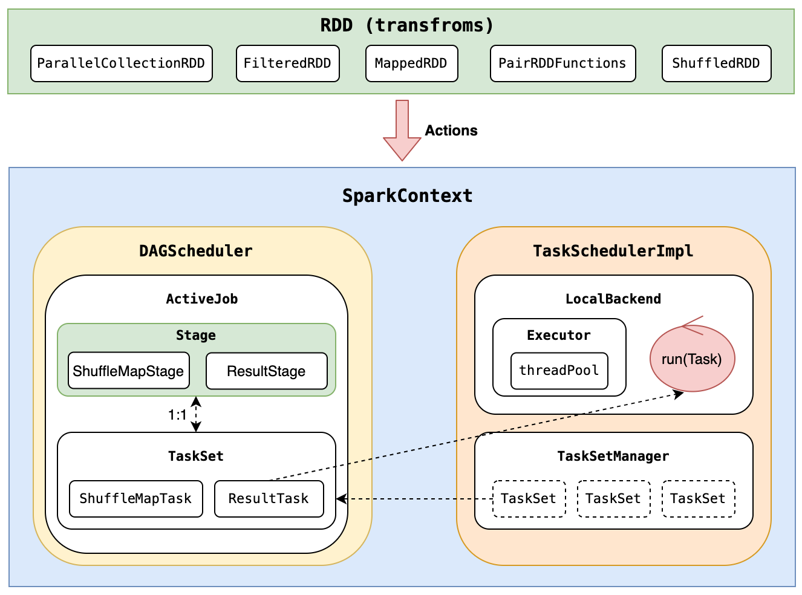
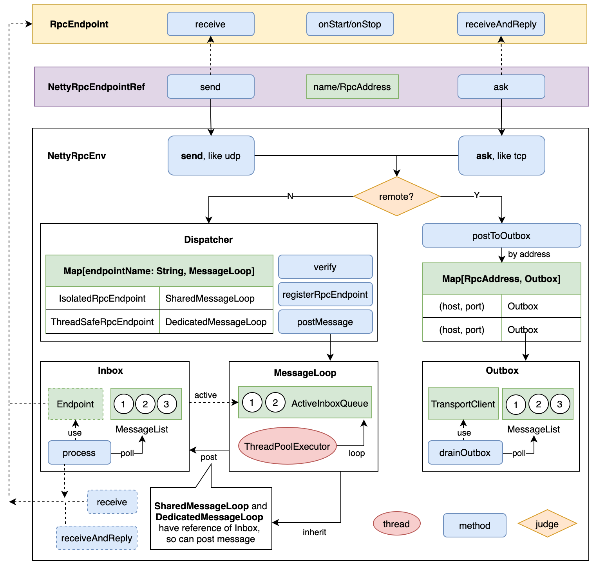

# 这个项目是干什么的
看了许利杰老师的[这本书](https://book.douban.com/subject/35140409/)，老师在理论层面讲的比较清楚了，读起来也容易理解，但看完但总是感觉还差点什么。
于是动手起了这个项目，定了个小目标：实现RDD的逻辑。在实操的过程中，也确实了解更多的代码细节，填补了一些盲点。

## 如何开始的
> "The Spark core engine itself has changed little since it was first released" -- Spark The Definitive Guide

说实话，直接从最新的代码库开始，是有些困难的（代码量庞大）；而且core部分理念变化不大，如是找了较老的版本来开始，参考了如下两个
- [commit](https://github.com/apache/spark/tree/5b021ce0990ec675afc6939cc2c06f041c973d17)
- [tag v1.0.0](https://github.com/apache/spark/tree/v1.0.0/)

## 运行环境
- Java 1.8
- Scala 2.13.8
```
git checkout v0.1.2-cluster-support

// open terminal 1, run driver process and wait
>sbt run

// open terminal 2, run executor process 1
>sbt
>runMain xyz.sourcecodestudy.spark.executor.CoarseGrainedExecutorBackend  --executor-id 13 --hostname spark://127.0.0.1:9993 --port 9993

// open terminal 3, run executor process 2
>sbt
>runMain xyz.sourcecodestudy.spark.executor.CoarseGrainedExecutorBackend  --executor-id 18 --hostname spark://127.0.0.1:9998 --port 9998
```

## 有什么用
用于源码学习，一个轻量（阉割版）、容易运行的Spark Core。成熟的大型开源项目，往往非常庞大，依赖关系错综复杂，直接源码运行是非常有挑战的，阻碍了很多同学深入研究的第一步。
这个项目只依赖`JDK1.8`和`Scala2.13`，就可以run起来；但却完整实现了RDD的核心逻辑，大幅降低深入研究源码的门槛。有了这个基础，再挑战master，相信信心倍增（这也正是作者实践的逻辑）。

# 当前提供的输出

## RDD的运行逻辑


## RPC实现的逻辑

## 实现的程度
- 目前单机单进程、单机多进程（1 Driver + n Executor）模式运行
- 完整的RDD核心逻辑（DGA、Shuffle、Aggregator）
- rpc模块独立运行
- cluster模式采用多进程模拟
```
// MainApp.scala
def main(args: Array[String]) = {

  val sc = new SparkContext(new SparkConf(false).setAll(parseArguments(args)))

  logger.warn(s"Enter application, driver = ${sc.master}")
  
  val rdd0 = sc.parallelize(Seq("a", "aa", "aaa", "aaaa", "aaa", "aaa", "aa", "aaaa", "aaaa", "aaaa"), 3)

  rdd0.map(k => (k, 1.toLong)).count().foreach(p => println(s"count ${p._1} -> ${p._2}")) 

  val rdd1 = sc.parallelize(Seq("aa" -> 1, "bb" -> 2, "aa" -> 3, "bc" -> 4, "bc" -> 5, "cc" -> 6, "ac" -> 7, "ac" -> 8, "ab" -> 9), 3)

  rdd1.groupByKey(2).foreach(p => println(s"group ${p._1} -> ${p._2.toSeq}"))

  val rdd2 = sc.parallelize(Seq("aa" -> 10, "bb" -> 20, "aa" -> 30, "bc" -> 40, "bc" -> 50, "cc" -> 60, "ac" -> 70, "ac" -> 80, "ab" -> 90), 2)

  rdd2.cogroup(rdd1).foreach{ cg => println(s"k = ${cg._1}, ${cg._2._1.toSeq} | ${cg._2._2.toSeq}") }
  
  sc.stop()
}

// Driver Output
[info] running xyz.sourcecodestudy.spark.MainApp 
2022-09-01 18:16:57 WARN MainApp$: Enter application, driver = spark://*
[success] Total time: 73 s (01:13), completed 2022-9-1 18:16:58

// Executor 1 Output
[info] running xyz.sourcecodestudy.spark.executor.CoarseGrainedExecutorBackend --executor-id 13 --hostname spark://127.0.0.1:9993 --port 9993
[success] Total time: 13 s, completed 2022-9-1 18:16:11
count aaaa -> 4
count a -> 1
count aaa -> 3
k = aa, List(10, 30) | List(1, 3)
k = bc, List(40, 50) | List(4, 5)
2022-09-01 18:16:58 WARN CoarseGrainedExecutorBackend: Code(1), Executor self-exiting due to Driver 127.0.0.1:9990 disassociated! Shutting down.

// Executor 2 Output
[info] running xyz.sourcecodestudy.spark.executor.CoarseGrainedExecutorBackend --executor-id 18 --hostname spark://127.0.0.1:9998 --port 9998
[success] Total time: 11 s, completed 2022-9-1 18:16:12
count aa -> 2
group ab -> List(9)
group bc -> List(4, 5)
group bb -> List(2)
group aa -> List(1, 3)
group cc -> List(6)
group ac -> List(7, 8)
k = ab, List(90) | List(9)
k = cc, List(60) | List(6)
k = bb, List(20) | List(2)
k = ac, List(70, 80) | List(7, 8)
2022-09-01 18:16:58 WARN CoarseGrainedExecutorBackend: Code(1), Executor self-exiting due to Driver 127.0.0.1:9990 disassociated! Shutting down.
```

## RPC独立运行
1，获取相应的tag
```
git checkout v0.1.1-rpc-independent
```

2，打开第一个终端
```
sbt
runMain xyz.sourcecodestudy.spark.rpc.demo.PongServer

// Output
2022-08-27 23:02:11 WARN PingPongEndpoint: [pingpong-endpoint] receive secret: Hi, I am PingClient.
2022-08-27 23:02:11 WARN PingPongEndpoint: [pingpong-endpoint] receive question: 2
2022-08-27 23:02:11 WARN PingPongEndpoint: [pingpong-endpoint] receive question: 1

```
3，打开第二个终端
```
sbt
runMain xyz.sourcecodestudy.spark.rpc.demo.PingClient

// Output
2022-08-27 23:02:11 INFO Inbox: process OnStart
2022-08-27 23:02:11 INFO NettyRpcEnv: [127.0.0.1:9992] send [Notify(Hi, I am PingClient.)], to [Some(127.0.0.1:9991)]
2022-08-27 23:02:11 INFO RpcEndpointVerifier: [endpoint-verifier] stared
2022-08-27 23:02:11 INFO Dispatcher: postMessage endpointName = endpoint-verifier
2022-08-27 23:02:11 INFO Inbox: process RemoteProcessConnected 127.0.0.1:9991
2022-08-27 23:02:11 INFO PingClient$: onComplete result = Pong(banana)
2022-08-27 23:02:11 INFO PingClient$: Get answer: Pong(apple)
[success] Total time: 5 s, completed 2022-8-27 23:02:11
```

# 实现说明
- 不支持cache
- 不支持checkpoint